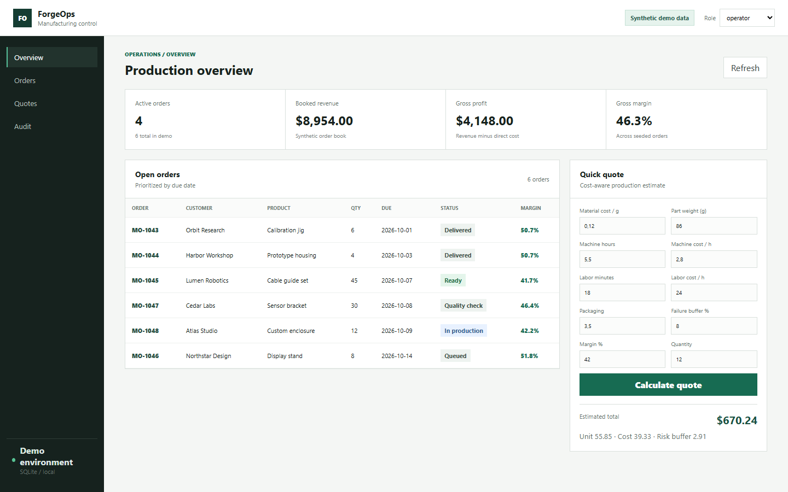

# Small Manufacturing Operations Demo

A portfolio-safe operations dashboard inspired by real small-manufacturing and 3D-printing workflows. Every customer, order and financial value is synthetic.



## What it demonstrates

- FastAPI API and SQLite persistence.
- Order pipeline and production status tracking.
- Cost-aware quote engine using `Decimal` arithmetic.
- Demo RBAC with viewer, operator and admin roles.
- Immutable audit events for status changes.
- Responsive, work-focused dashboard without a frontend framework.
- Tests, GitHub Actions and Docker packaging.

## Run

```bash
python -m venv .venv
.venv\Scripts\activate
python -m pip install -r requirements.txt
python -m uvicorn app.main:app --reload
```

Open `http://127.0.0.1:8000`. API documentation is available at `/docs`.

## Test

```bash
pytest -q
```

## Safety boundary

This repository has a fresh public history and does not contain production databases, customer records, invoices, receipts, credentials, business prices or private brand assets. Header-based roles are intentionally limited to the local demo and are not presented as production authentication.

## License

MIT
